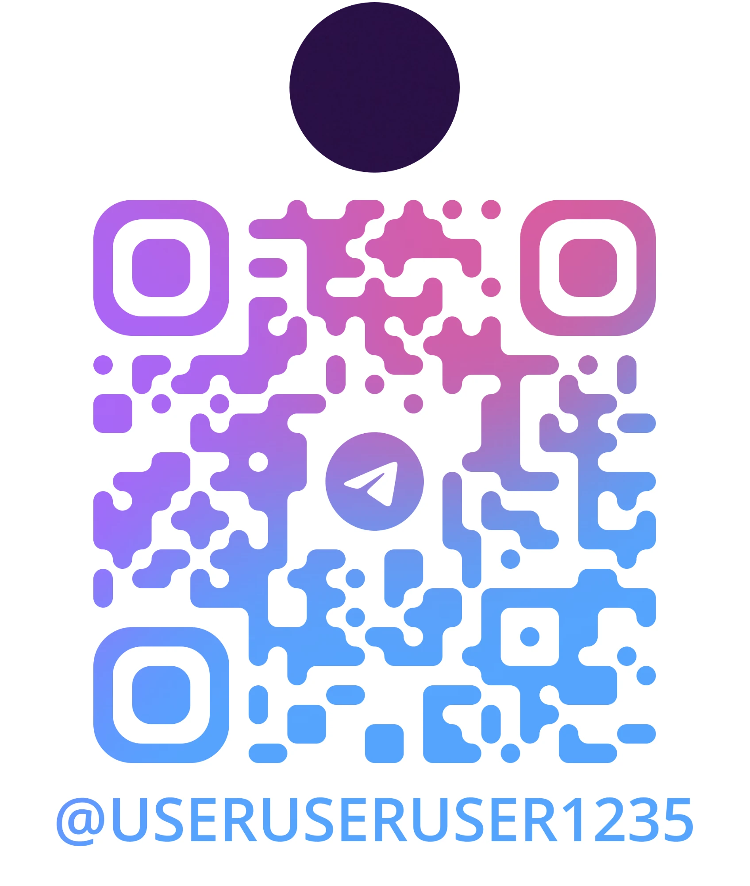

# Candidate Instructions

This is a sloppy prototype. Before doing anything else, read `PROTOTYPE_README.md` so you understand what the bot is meant to do and how the pieces fit together.

Your job is to bring it towards the finish line.

## What you're walking into

The codebase has:

- A few hidden bugs that affect real behavior.
- Functionalities that work but purposefully suck.
- Things that are simply not good practice for maintainable, production-quality code.

We are not telling you what any of those are. Identifying them is part of the test.

## API keys

To run the bot you will need the relevant API keys. You can use your own, or reach out to us on Telegram and we will provide them: scan the QR code below or search for [@useruseruser1235](https://t.me/useruseruser1235).

## What we want from you

1. Read the code. Run it. See what it does and what it doesn't.
2. Decide what is worth fixing given your time budget, what is not, and why.
3. Fix what you choose to fix.
4. Document everything — what you found, what you fixed, what you didn't — in `bugs.md`.

You are free to use AI tools. We don't care how you get there — we care that the result is clean, maintainable code that is closer to or at production quality.

## The `bugs.md` report

You will find a stub `bugs.md` in this directory. Fill it in. It has four sections:

- **Bugs I found** — every issue you identified, fixed or not.
- **Bugs I fixed** — what you changed and why.
- **Bugs I did not fix** — what you would do if you had more time, and why you skipped it.
- **Other things that should be done with this code** — broader improvements, refactors, hygiene, or process work that is not a bug per se but is real.

For every item in every section: name it, describe how you fixed it (or planned to), and explain why.

We care about your reasoning as much as your code.

## Questions

For any issue or question, reach out on Telegram: [@useruseruser1235](https://t.me/useruseruser1235).

## The bigger picture

This is an open question. There is no ceiling.

Once you have dealt with the bugs and the obvious rough edges, ask yourself: what would it actually take to run this thing in production? Think about reliability, observability, security, scalability, developer experience, deployment, testing. Think about what happens when it breaks at 2am, when traffic spikes, when a third-party API goes down, when a new developer joins the team.

You are not expected to implement all of it. But we want to see that you can think at that level — and that you can communicate what you would do, why, and in what order.

## Submission

**Do not push your changes to this repo.**

Create a **private** GitHub repo under your own account, push your work there, and add **[@costaterranova](https://github.com/costaterranova)** as a collaborator. We keep submissions private so other candidates cannot copy your work.

Send us the repo URL when you are done.
